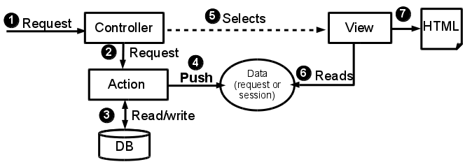

mvcblog
=======
A Simple Model-View-Controller Blog Example written PHP, for educational
purposes. The MVC framework is embedded in the application itself, it is not a
separate library, so all the code can be easily explored in order to understand
how the action-based MVC works.

**Note: This is an educational project. If you are looking for a framework for a
professional project, I recommend you to use any other MVC framework (there
are many out there!).**

**New! An alternative (beta), component-based (or pull) example is also
available at
[https://github.com/lipido/mvcblog-pull](https://github.com/lipido/mvcblog-pull)**

The main MVC components are implemented in the following way:

1. **Model**. Each domain entity is a class. In addition to domain classes,
there are _data mappers_ which are responsible of SQL sentences needed to
retrieve and save instances of the domain objects from and into the database.
For example Post and PostMapper are domain objects and _data mappers_,
respectively.
2. **View**. Views are plain PHP scripts, with the only responsibility of
generating the data views and user input.
3. **Controller**. Controllers are PHP classes. Every HTTP request is dispatched
by one controller. More specifically, by one _action_ inside a controller.
Actions are simple methods inside controllers.

In addition to the minimum components, this example contains:

- A view helper class (`ViewManager`), which includes a layout system for the
views. All your views are embedded inside _layouts_, which contain all the
repetitive HTML (headers, footers, css declarations, etc). You can use more
than one layout if you want (in the example, we use two layouts).
- An simple internationalization helper class (`I18n`).

# Model View Controller
The action-based (or push) MVC frameworks can be seen as in the following figure:



# Requirements
1. PHP 5.4.0.
2. MySQL (tested in 5.5.40).
3. A PHP-capable HTTP Server (tested in Apache 2).

# Create username for the database
Create a username for the database. The connection settings in the PHP code are
in /core/PDOConnection.php
```sql
create user 'mvcuser'@'localhost' identified by 'mvcpass';
grant all privileges on mvcblog.* to 'mvcuser'@'localhost' WITH GRANT OPTION;
```

# Database creation script
Connect to MySQL console and paste this script.
```sql
create database mvcblog;
use mvcblog;
create table users (
		username varchar(255),
		passwd varchar(255),
		email varchar(255),
		primary key (username)
) ENGINE=INNODB DEFAULT CHARACTER SET = utf8;

create table expenses (
	id int auto_increment,
	typeDB enum ('combustible', 'alimentacion', 'comunicaciones', 'suministros', 'ocio'),
	dateDB date,
	quantityDB varchar(255),
	descriptionDB varchar(255),
	fileDB varchar(255),
	ownerDB varchar(255) not null,
	primary key (id),
	foreign key (ownerDB) references users(username) on delete cascade
) ENGINE=INNODB DEFAULT CHARACTER SET = utf8;

CREATE TABLE user_tokens(
	id INT AUTO_INCREMENT PRIMARY KEY, 
	token VARCHAR(255) NOT NULL, 
	expiry DATETIME NOT NULL, 
	username_fk VARCHAR(255) NOT NULL, 
	CONSTRAINT fk_user 
	foreign key (username_fk) references users(username) on delete cascade 
)ENGINE=INNODB DEFAULT CHARACTER SET = utf8;


```

# TODO

- Add a decent CSS.
- Include the URL rewriting mechanism to get pretty urls.
